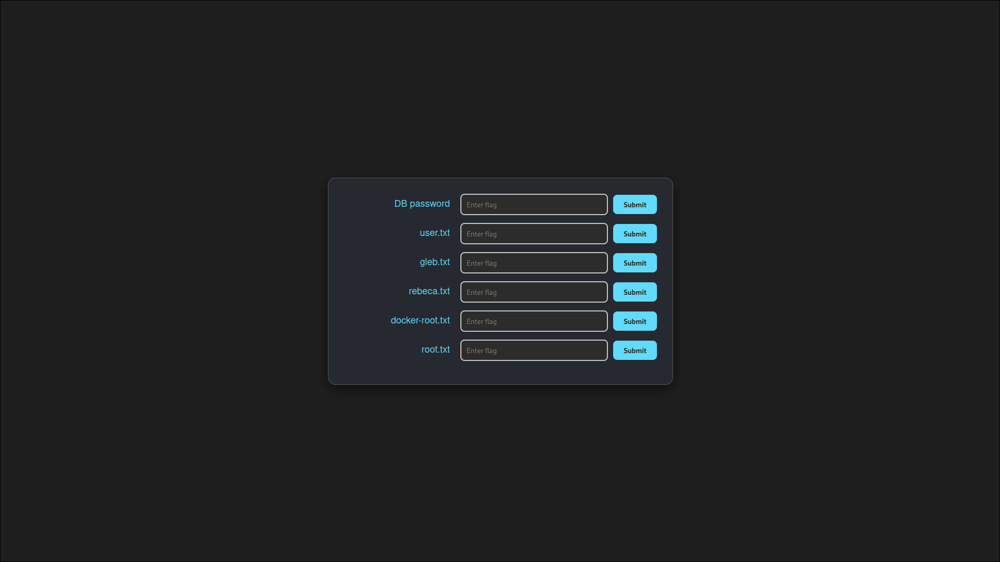

# 🏁 CTF Flag Verification Site

This project is a web-based flag verification system, designed specifically for use with the [CTF competition](https://github.com/ilolm/docker-CTF). It allows CTF participants to submit flags and receive instant feedback.

---

## ✨ Features

- 🚀 **Easy Setup**: Deploy quickly using Docker Compose.
- ⚡ **Instant Feedback**: Flags are checked immediately upon submission.
- 🔒 **Session Tracking**: Maintains state across submissions.

---

## 🛠️ Requirements

- 🐋 **Docker**
- 🧩 **Docker Compose**

---

## 🚀 Getting Started

1. **Clone the repository**:
    ```bash
    git clone https://github.com/ilolm/ctf-flag-verification-site.git
    cd ctf-flag-verification-site
    ```

2. **Start the Application**:
    ```bash
    docker-compose up -d
    ```

3. **Open the Site**:
    Navigate to `http://localhost` in your web browser.

---

## 📸 Screenshot



---

## 🗂️ Project Structure

- **/initdb**: SQL scripts for initializing the MySQL database.
- **/src**: Source code for the web application.
- **docker-compose.yml**: Configuration for Docker Compose.

---

## 📌 Notes

This verification site is tailored for the [CTF competition](https://github.com/ilolm/docker-CTF) to provide a seamless experience for flag verification.

---

## 📜 License

This project is licensed under the MIT License.
